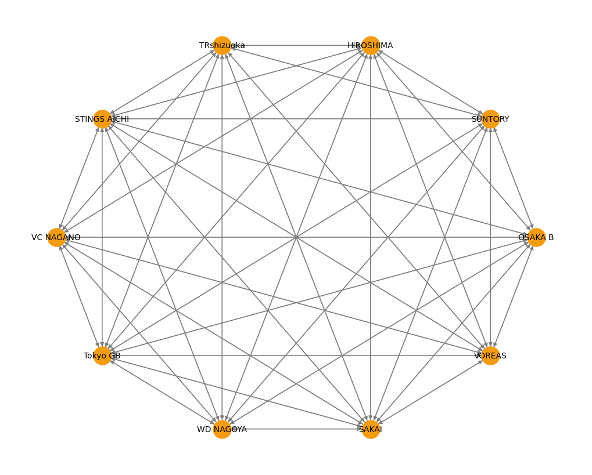

# Daido Life SV League Schedule Analysis

As you can see, the network here is more interconnected than the V League (possibly due to the difference in the numbers of teams). While the graph may seem complete, there are some teams that haven't played each other as of January 14 (such as *OSAKA* B vs. *TRshizuoka* or *VC NAGANO* vs. *SUNTORY*)

Scores are calculated the same way as previously. The final scores displayed in the second notebook represent how evenly-matched two teams are. The higher magnitude (absolute value) the score is, the more evenly-matched the teams are. However, there is not a upper bound to the metric and should be used a relative metric between matches to determine which match is "*more* evenly-matched". The lower bound of the metric is `1`.

## Match recommendations (as a Tokyo resident)

Here are the top 10 matches recommended to me if I were traveling from Tokyo to each of the venues:
<table border="1" class="dataframe">
  <thead>
    <tr style="text-align: right;">
      <th></th>
      <th>date</th>
      <th>home_team</th>
      <th>away_team</th>
      <th>venue</th>
      <th>cost</th>
      <th>score_per_cost</th>
    </tr>
  </thead>
  <tbody>
    <tr>
      <th>0</th>
      <td>2025-03-02 14:05:00</td>
      <td>Tokyo GB</td>
      <td>OSAKA B</td>
      <td>Ariake Coliseum</td>
      <td>420</td>
      <td>20.085205</td>
    </tr>
    <tr>
      <th>23</th>
      <td>2025-03-15 15:05:00</td>
      <td>Tokyo GB</td>
      <td>SUNTORY</td>
      <td>Tokyo Metropolitan Gymnasium</td>
      <td>360</td>
      <td>0.028028</td>
    </tr>
    <tr>
      <th>18</th>
      <td>2025-04-05 12:00:00</td>
      <td>TRshizuoka</td>
      <td>HIROSHIMA</td>
      <td>TBC</td>
      <td>670</td>
      <td>0.020368</td>
    </tr>
    <tr>
      <th>39</th>
      <td>2025-02-09 14:05:00</td>
      <td>Tokyo GB</td>
      <td>HIROSHIMA</td>
      <td>Ariake Coliseum</td>
      <td>420</td>
      <td>0.014401</td>
    </tr>
    <tr>
      <th>84</th>
      <td>2025-04-05 15:05:00</td>
      <td>Tokyo GB</td>
      <td>SAKAI</td>
      <td>Yoyogi National Stadium 2nd Gymnasium</td>
      <td>260</td>
      <td>0.014328</td>
    </tr>
    <tr>
      <th>73</th>
      <td>2025-02-19 19:05:00</td>
      <td>Tokyo GB</td>
      <td>TRshizuoka</td>
      <td>Yoyogi National Stadium 2nd Gymnasium</td>
      <td>260</td>
      <td>0.012193</td>
    </tr>
    <tr>
      <th>2</th>
      <td>2025-02-08 13:05:00</td>
      <td>SUNTORY</td>
      <td>WD NAGOYA</td>
      <td>Asue Arena Osaka</td>
      <td>15220</td>
      <td>0.010849</td>
    </tr>
    <tr>
      <th>7</th>
      <td>2025-03-29 14:05:00</td>
      <td>TRshizuoka</td>
      <td>VC NAGANO</td>
      <td>Konohana Arena</td>
      <td>6840</td>
      <td>0.003065</td>
    </tr>
    <tr>
      <th>9</th>
      <td>2025-02-08 14:05:00</td>
      <td>TRshizuoka</td>
      <td>SAKAI</td>
      <td>Koryo Arena</td>
      <td>4810</td>
      <td>0.002552</td>
    </tr>
    <tr>
      <th>4</th>
      <td>2025-02-01 12:05:00</td>
      <td>SUNTORY</td>
      <td>STINGS AICHI</td>
      <td>Ookini Arena Maishima</td>
      <td>15140</td>
      <td>0.002508</td>
    </tr>
  </tbody>
</table> 

One of the metrics seems to have been miscalculated, or have not been scaled properly. Contrary to the previous V league recommendations, the matches recommended here are more spread out, which could be due to the lesser amount of teams and matches in this league. The match that I'm most looking forward to (<i>Tokyo GB</i> vs. <i>OSAKA B</i>) appears top in the list. While the `score_per_cost` may be a miscalculation, the system correctly predicted my most anticipated match.

## Match recommendations (as a week-long trip)

We also perform the similar DBSCAN clustering to find out the combinations of matches I could watch over a week-long trip to somewhere in the country. The largest cluster does not appear in the Kanto region, but centered in the Kansai region.

<table border="1" class="dataframe">
  <thead>
    <tr style="text-align: right;">
      <th></th>
      <th>date</th>
      <th>home_team</th>
      <th>away_team</th>
      <th>venue</th>
    </tr>
  </thead>
  <tbody>
    <tr>
      <th>4</th>
      <td>2025-02-01 12:05:00</td>
      <td>SUNTORY</td>
      <td>STINGS AICHI</td>
      <td>Ookini Arena Maishima</td>
    </tr>
    <tr>
      <th>49</th>
      <td>2025-02-01 14:05:00</td>
      <td>OSAKA B</td>
      <td>HIROSHIMA</td>
      <td>Panasonic Arena</td>
    </tr>
    <tr>
      <th>42</th>
      <td>2025-02-01 15:05:00</td>
      <td>SAKAI</td>
      <td>VOREAS</td>
      <td>Ohama Daishin Arena</td>
    </tr>
    <tr>
      <th>5</th>
      <td>2025-02-02 12:05:00</td>
      <td>SUNTORY</td>
      <td>STINGS AICHI</td>
      <td>Ookini Arena Maishima</td>
    </tr>
    <tr>
      <th>41</th>
      <td>2025-02-02 13:05:00</td>
      <td>SAKAI</td>
      <td>VOREAS</td>
      <td>Ohama Daishin Arena</td>
    </tr>
    <tr>
      <th>48</th>
      <td>2025-02-02 14:05:00</td>
      <td>OSAKA B</td>
      <td>HIROSHIMA</td>
      <td>Panasonic Arena</td>
    </tr>
    <tr>
      <th>2</th>
      <td>2025-02-08 13:05:00</td>
      <td>SUNTORY</td>
      <td>WD NAGOYA</td>
      <td>Asue Arena Osaka</td>
    </tr>
    <tr>
      <th>102</th>
      <td>2025-02-08 14:05:00</td>
      <td>OSAKA B</td>
      <td>VC NAGANO</td>
      <td>Panasonic Arena</td>
    </tr>
  </tbody>
</table>
