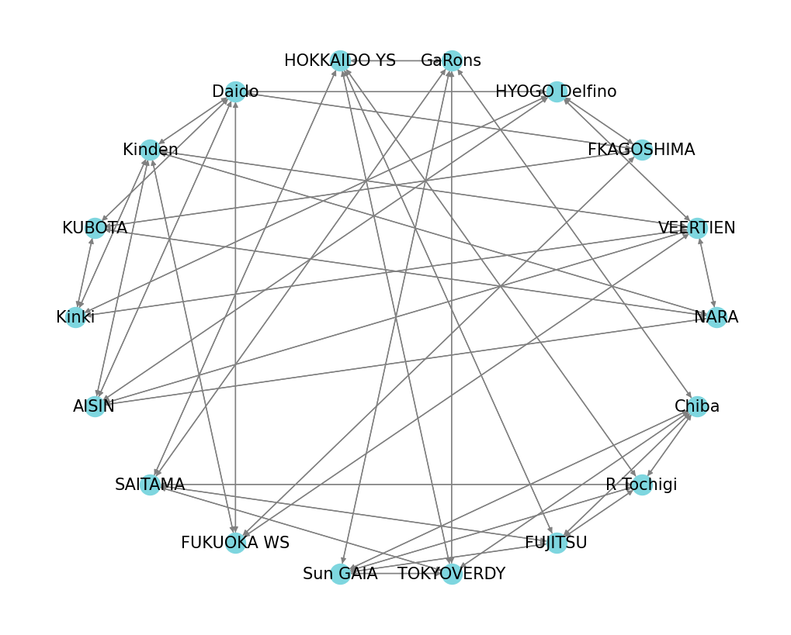

# Japanese Volleyball League Schedule Analysis

As the title suggests, this is a analysis for the upcoming schedule of the Japanese V League, to figure out which matches I should go watch. I live in Tokyo, and the matches take place all over the country, and I want to figure which matches I should watch to receive the most enjoyment per yen spent. This analysis has two parts:
1. Evaluating how *exciting* or *enjoyable* a match will be.
2. How much *time* and *money* it takes for me to travel to the location.

If you're interested in volleyball, feel free to consider my results. I can't assure they're the most accurate (especially because I think my metric #1 for *satisfaction* is flawed), and this project is more of a fun proof-of-concept.

## Enjoyment Evaluation

As you might expect, the amount of enjoyment I'm going to receive from a match between teams that haven't played yet is pretty hard to accurately predict. I've decided to keep things simple and derive this from how **evenly-matched** I think two teams are going to be. 

The principle I used is as follows: if team A played team B and they're evenly matched, and if team B played team C and they're evenly matched, then in theory, when team A plays team C, they will also be evenly matched. In practice, however, this might not be the case. If the star players of one of the teams become injured, or if the playstyles of one of the teams make them advantageous over the other, the results could vary.

Nonetheless, for simplicity's sake, I've decided to go with this method. Instead of using three teams, I expanded to a graph of teams, where the paths between two nodes on the graph represent the same logical as before.



Let ) represent the score difference between two teams, A and B. This is calculated by the past matches between the two teams, and is represented by the weight of the directecd edge from A to B.
- If =0) then the teams are perfectly evenly matched.
- If >0) then A is "stronger" than B.
- If <0) then B is "stronger" than A.

Then if A has not played C, then we can use intermediate matches to define the relationship \approx&space;S(A,B)&plus;S(B,C)). For a graph, we take any path between A and C that is less than or equal to `k` edges and take the mean of the sum of weights along each of those paths. 

There are four iterations of this method (each weighing the path sums differently) in `predicted_scores_manual.py`.

To evaluate these metrics, we take the least-squares error sum between the scores generated by the four methods and the position of the team on their leaderboard (generated in `leaderboard.py`). This is done in `predicted_scores_evaluation.py`.

## Venue Analysis

Now onto the second part: how feasible is it for me to visit these venues. Originally, I was planning on only considering matches that I could travel to comfortably (matches in the Kanto region), but I also consider matches that are close together geographically and in their timing that I can visit the area for a week or so, and watch multiple matches in that time frame (see clustering section after this).

Initially, my scores for **evenly-matched**-ness, calculated prior, are between -1 and 1, and the closer they are to 0, the more evenly matched the teams are. I augment my scores to `score = 1 / score` so the greater the score is, the more evenly matched the teams are. Then, I calculate `score / cost` for the best "bang-for-my-buck" matches (theoretically, at least). Here are the top 10 (removing repeats):

<table border="1" class="dataframe">
  <thead>
    <tr style="text-align: right;">
      <th></th>
      <th>date</th>
      <th>home_team</th>
      <th>away_team</th>
      <th>venue</th>
      <th>mean_score</th>
      <th>cost</th>
      <th>time</th>
      <th>score_per_cost</th>
    </tr>
  </thead>
  <tbody>
    <tr>
      <th>5</th>
      <td>2025-01-19 12:00:00</td>
      <td>Chiba</td>
      <td>TOKYOVERDY</td>
      <td>YohaSアリーナ～本能に、感動を。～</td>
      <td>-31.183427</td>
      <td>530</td>
      <td>00:59:00</td>
      <td>0.058837</td>
    </tr>
    <tr>
      <th>9</th>
      <td>2025-03-01 13:00:00</td>
      <td>FUJITSU</td>
      <td>GaRons</td>
      <td>宮前スポーツセンター</td>
      <td>27.735218</td>
      <td>730</td>
      <td>01:32:00</td>
      <td>0.037993</td>
    </tr>
    <tr>
      <th>22</th>
      <td>2025-02-02 13:00:00</td>
      <td>FUJITSU</td>
      <td>Sun GAIA</td>
      <td>Culttz Kawasaki</td>
      <td>9.343948</td>
      <td>860</td>
      <td>01:00:00</td>
      <td>0.010865</td>
    </tr>
    <tr>
      <th>47</th>
      <td>2025-02-23 16:30:00</td>
      <td>Sun GAIA</td>
      <td>GaRons</td>
      <td>Tsukuba Capio</td>
      <td>-12.433803</td>
      <td>1370</td>
      <td>01:27:00</td>
      <td>0.009076</td>
    </tr>
    <tr>
      <th>40</th>
      <td>2025-02-09 13:00:00</td>
      <td>FUJITSU</td>
      <td>R Tochigi</td>
      <td>小田原アリーナ</td>
      <td>-7.708711</td>
      <td>1060</td>
      <td>02:22:00</td>
      <td>0.007272</td>
    </tr>
    <tr>
      <th>57</th>
      <td>2025-02-16 13:00:00</td>
      <td>TOKYOVERDY</td>
      <td>FUJITSU</td>
      <td>稲城市総合体育館</td>
      <td>-4.384201</td>
      <td>920</td>
      <td>01:42:00</td>
      <td>0.004765</td>
    </tr>
    <tr>
      <th>67</th>
      <td>2025-03-02 13:00:00</td>
      <td>TOKYOVERDY</td>
      <td>R Tochigi</td>
      <td>日野市市民の森ふれあいホール</td>
      <td>-3.139964</td>
      <td>790</td>
      <td>01:24:00</td>
      <td>0.003975</td>
    </tr>
    <tr>
      <th>30</th>
      <td>2025-03-09 13:00:00</td>
      <td>R Tochigi</td>
      <td>GaRons</td>
      <td>FUKAI SQUARE GARDEN 足利</td>
      <td>9.564765</td>
      <td>2440</td>
      <td>02:17:00</td>
      <td>0.003920</td>
    </tr>
    <tr>
      <th>6</th>
      <td>2025-01-19 12:00:00</td>
      <td>GaRons</td>
      <td>FUJITSU</td>
      <td>須坂市市民体育館</td>
      <td>-27.735218</td>
      <td>8900</td>
      <td>02:57:00</td>
      <td>0.003116</td>
    </tr>
    <tr>
      <th>111</th>
      <td>2025-01-26 14:00:00</td>
      <td>SAITAMA</td>
      <td>FUJITSU</td>
      <td>富士見市市民総合体育館</td>
      <td>2.130752</td>
      <td>740</td>
      <td>01:39:00</td>
      <td>0.002879</td>
    </tr>
  </tbody>
</table>

As expected, the cost is a large factor in these scores. All but one of these matches take place in Kanto, and looking at the `cost` column, it's pretty easy to see which one that is. Unfortunately, my favorite team, the Hokkaido Yellow Stars and my most anticipated game, their away game against Chiba (the closest venue to me), doesn't show up on this list to the apparent different in their evenly-matched-ness. This suggests some unreliability or inadequacy in my metric.

BUT, I did realize there are a series of matches between the teams FUIJITSU, GaRons, Sun GAIA, and R Tochigi in (fairly) affordably-distanced venues. For a simpler analysis, the following returns the matches happening the closest by, then sortest by their evely-matched-ness:
```python
match_with_venues.loc[
    match_with_venues
        .sort_values(by=['cost', 'score', 'date'], ascending=[True, False, True])[['cost', 'score']]
        .drop_duplicates(keep='first', inplace=False)
        .index
].drop(['latitude', 'longitude'], axis=1, errors='ignore')
```
### Clustering

Traveling from my home in Tokyo across the country and back in a single day is, without question, extremely exhausting. If I wanted to watch volleyball matches consecutively, I'd be better off traveling to another area, then watching matches over a period of time.

Each venue has a latitude and longitude coordinate, and each match had a venue and time associated with it. We use [DBSCAN](https://scikit-learn.org/stable/modules/generated/sklearn.cluster.DBSCAN.html) to cluster matches by time and venue, with `eps=0.5` and `metrics='euclidean'`. Additionally, we manually set a limit to the time parameters: specifically that all matches within a cluster must happen within the time frame of a 8 days. This method also does not consider matches that take place simultaenously (and includes them in the same cluster).

While no limits for distance have been hardcoded, the venues contained in a single cluster can be traveled to and from without the need for the Shinkansen (high speed bullet train), but other limited express trains may be required.

The following is the largest cluster not in Kanto. This cluster is mostly based in Kansai (with the exception of a match in the Mie prefecture).
<table border="1" class="dataframe">
  <thead>
    <tr style="text-align: right;">
      <th></th>
      <th>date</th>
      <th>home_team</th>
      <th>away_team</th>
      <th>venue</th>
    </tr>
  </thead>
  <tbody>
    <tr>
      <th>16</th>
      <td>2025-03-15 11:00:00</td>
      <td>VEERTIEN</td>
      <td>FKAGOSHIMA</td>
      <td>亀山市西野公園体育館</td>
    </tr>
    <tr>
      <th>27</th>
      <td>2025-03-15 12:00:00</td>
      <td>NARA</td>
      <td>HYOGO Delfino</td>
      <td>西部生涯スポーツセンター</td>
    </tr>
    <tr>
      <th>52</th>
      <td>2025-03-15 14:00:00</td>
      <td>AISIN</td>
      <td>Kinki</td>
      <td>碧南市臨海体育館</td>
    </tr>
    <tr>
      <th>95</th>
      <td>2025-03-15 14:00:00</td>
      <td>Daido</td>
      <td>Kinden</td>
      <td>メディアス体育館ちた</td>
    </tr>
    <tr>
      <th>17</th>
      <td>2025-03-16 10:00:00</td>
      <td>VEERTIEN</td>
      <td>FKAGOSHIMA</td>
      <td>亀山市西野公園体育館</td>
    </tr>
    <tr>
      <th>26</th>
      <td>2025-03-16 12:00:00</td>
      <td>NARA</td>
      <td>HYOGO Delfino</td>
      <td>西部生涯スポーツセンター</td>
    </tr>
    <tr>
      <th>53</th>
      <td>2025-03-16 13:00:00</td>
      <td>AISIN</td>
      <td>Kinki</td>
      <td>碧南市臨海体育館</td>
    </tr>
    <tr>
      <th>94</th>
      <td>2025-03-16 13:00:00</td>
      <td>Daido</td>
      <td>Kinden</td>
      <td>メディアス体育館ちた</td>
    </tr>
    <tr>
      <th>75</th>
      <td>2025-03-22 14:00:00</td>
      <td>Daido</td>
      <td>FUKUOKA WS</td>
      <td>弥富市総合社会教育センター</td>
    </tr>
  </tbody>
</table>

